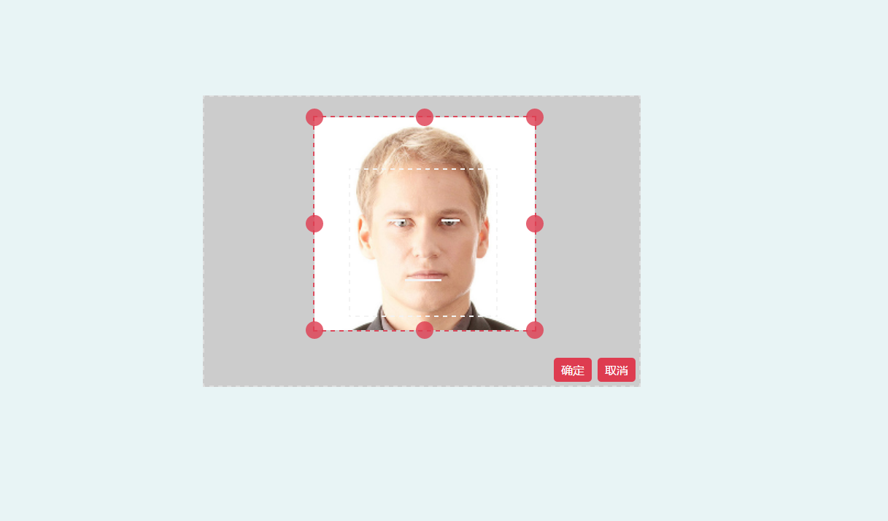
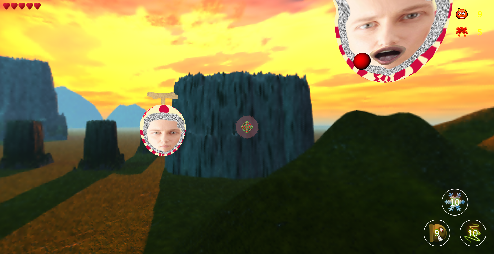
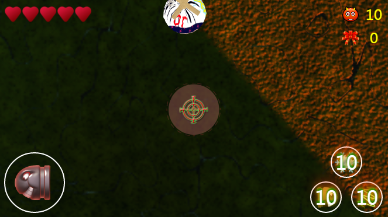

# MindYourHead
使用 ThreeJs 框架写的一款 3D 射击游戏

<!-- toc -->

- [游戏介绍](#%E6%B8%B8%E6%88%8F%E4%BB%8B%E7%BB%8D)
- [操作](#%E6%93%8D%E4%BD%9C)
  * [电脑](#%E7%94%B5%E8%84%91)
- [存在问题](#%E5%AD%98%E5%9C%A8%E9%97%AE%E9%A2%98)

<!-- tocstop -->

## 游戏介绍

首先选取一张包含人脸的图片，人脸尽可能以便于裁剪。裁剪框有三条提示线，分别对应人的双眼和嘴。通过调节图片的大小，使双眼和嘴尽量重合。裁剪的图片会被用做怪物的脸。下面是游戏截图：

**裁剪**  

 

**游戏界面（电脑端）**  

 

**游戏界面（手机端，使用重力感应）**

 

**游戏界面（手机端，不使用重力感应）**

 

游戏设置了四种武器：
* 普通子弹 - 第一次击中怪物后，会使怪物脸发生变形，第二次击中怪物后才会杀死怪物
* 冷冻弹 - 爆炸后使怪物停止移动
* 炮弹 - 爆炸后会产生很多小子弹，不会自动引爆，发射后需要点击普通子弹操作引爆
* 激光 - 碰到怪物就可以杀死怪物

游戏设置了两种模式 - 闯关模式和计分模式。本来还有一个对战模式，通信使用 websocket + java web, 但是因为没有 java 服务器，所以把这个模式去掉了。

如果在移动端玩这个游戏，注意使用横屏模式。建议使用 chrome 浏览器。

## 操作
游戏可以支持电脑和移动设备，对于电脑通过按键来控制移动和攻击，对于移动设备通过对应的网页图标移动即可。

### 电脑
* 上下左右 方向键 - 移动
* `空格` - 停止移动
* `S` - 发射子弹
* `W` - 发射冷冻弹（使怪物停止移动） 
* `A` - 发送炮弹（发送之后，需要通过 `S` 键引爆，否则不会爆炸）
* `D` - 使用激光

## 存在问题
电脑端一般没什么问题，但是在手机上有一些问题：
* 重力感应有时会失效
* 无法自动播放音乐，自动播放的音乐全部失效
* 无法锁定横屏
* 无法保持屏幕常亮